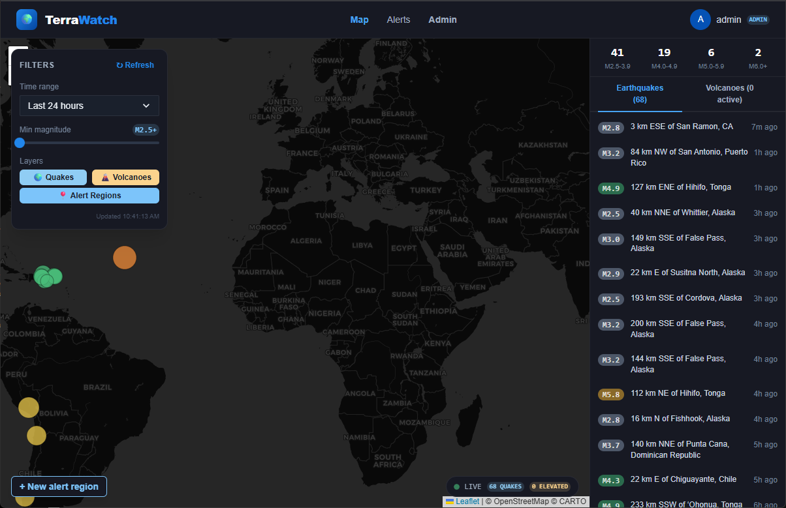
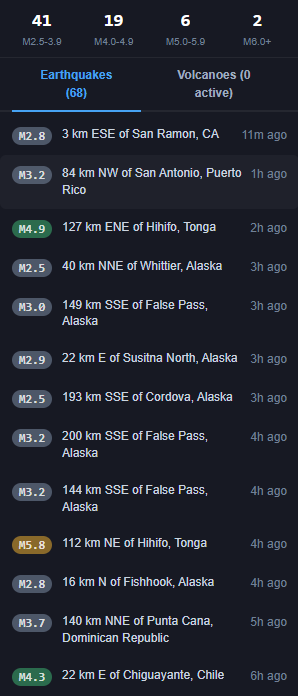
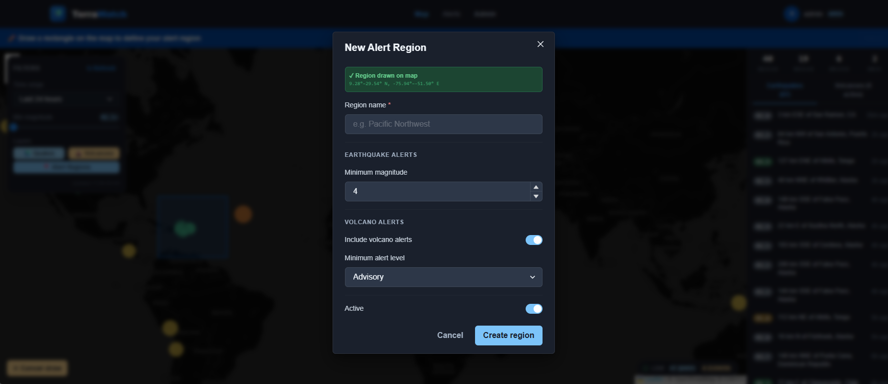
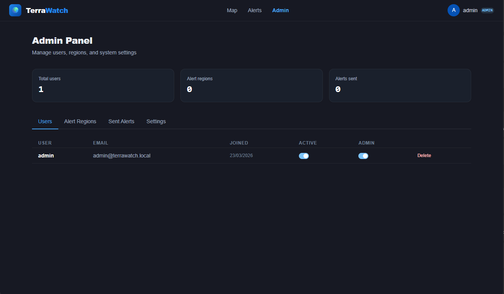
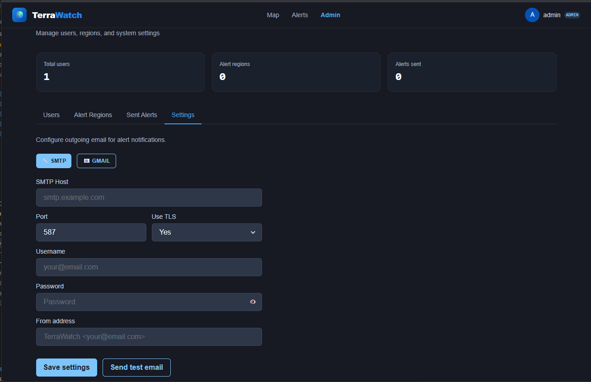

# 🌍 TerraWatch

A self-hosted real-time seismic and volcanic activity monitor. Watch earthquakes and volcanoes as they happen, define regional alert areas, and get notified via email, SMS, or push notification.

[](https://python.org)
[](https://react.dev)
[](https://docker.com)
[](https://postgresql.org)
[](https://chakra-ui.com)

---

## Screenshots


*Live world map showing real-time earthquake and volcano activity*


*Live earthquake and volcano feed with magnitude badges*


*Per-region alert thresholds and notification preferences*


*Admin panel — user management and email settings*


*Configurable Gmail or SMTP email notifications*

---

## Features

- **Live world map** — earthquakes sized and coloured by magnitude, volcano markers with alert level colour coding
- **Real-time data** — powered by the USGS Earthquake API and USGS HANS Volcano API, refreshed every 2 minutes
- **Regional alert regions** — draw a rectangle on the map to define a monitoring area
- **Multi-channel notifications** — email (Gmail or SMTP), SMS (Twilio), and browser push notifications
- **Configurable thresholds** — set minimum earthquake magnitude and minimum volcano alert level per region
- **Alert history** — full log of every notification sent
- **User accounts** — email/password auth with JWT, each user manages their own regions
- **Admin panel** — user management, alert region overview, sent alerts log
- **Email settings** — configure Gmail or custom SMTP via the admin UI, with test email button
- **Dark-themed UI** — built with Chakra UI 2.x, React 18, Vite

---

## Stack

| Layer | Technology |
|---|---|
| Frontend | React 18, Vite, Chakra UI 2.x, Leaflet, React Query |
| Backend | Python 3.12, FastAPI, APScheduler |
| Database | PostgreSQL 16 |
| Auth | JWT (python-jose) + bcrypt |
| Notifications | Gmail / SMTP email, Twilio SMS, Web Push (VAPID) |
| Data sources | USGS Earthquake Catalog API, USGS HANS Volcano API |
| Infrastructure | Docker Compose, Nginx |

---

## Getting Started

### Prerequisites

- [Docker](https://docs.docker.com/get-docker/) and [Docker Compose](https://docs.docker.com/compose/install/)

### Installation

1. **Clone the repository**
```bash
   git clone https://github.com/devoidx/terrawatch.git
   cd terrawatch
```

2. **Create your `.env` file**
```bash
   cp .env.example .env
```
   Generate a secret key:
```bash
   python3 -c "import secrets; print(secrets.token_hex(32))"
```
   Add it to `.env`:
```
   SECRET_KEY=your-generated-key-here
```

3. **Build and start**
```bash
   sudo docker compose up --build
```

4. **Access the app**

   | Service | URL |
   |---|---|
   | Frontend | http://localhost:3002 |
   | API docs | http://localhost:8001/docs |

5. **Log in with the default admin account**

   | Field | Value |
   |---|---|
   | Username | `admin` |
   | Password | `changeme` |

   > ⚠️ Change the admin password immediately after first login via the **Profile** page.

---

## Configuration

### Environment variables

Only `SECRET_KEY` is required to run. All notification settings can be configured through the admin UI after login.
```bash
# Required
SECRET_KEY=your-secret-key

# Optional — can also be set via Admin → Settings
SMTP_HOST=
SMTP_PORT=587
SMTP_USER=
SMTP_PASSWORD=
SMTP_FROM=

# Twilio SMS (optional)
TWILIO_ACCOUNT_SID=
TWILIO_AUTH_TOKEN=
TWILIO_FROM_NUMBER=

# Web Push (optional)
VAPID_PUBLIC_KEY=
VAPID_PRIVATE_KEY=
VAPID_CONTACT_EMAIL=
```

### Email notifications

Email can be configured through **Admin → Settings** without restarting the app. Two providers are supported:

**Gmail:**
1. Enable 2-Step Verification at [myaccount.google.com/security](https://myaccount.google.com/security)
2. Generate an app password at [myaccount.google.com/apppasswords](https://myaccount.google.com/apppasswords)
3. In Admin → Settings, select Gmail, enter your address and the 16-character app password
4. Click **Send test email** to verify

**SMTP:**
Enter your SMTP host, port, credentials, and from address. Works with any standard SMTP provider.

### SMS notifications (Twilio)

Add your Twilio credentials to `.env`, then enable SMS in your notification preferences (Alerts → Notification Settings).

### Push notifications (Web Push)

Generate VAPID keys:
```bash
python3 -c "from py_vapid import Vapid; v=Vapid(); v.generate_keys(); print('PUBLIC:', v.public_key); print('PRIVATE:', v.private_key)"
```
Add the keys to `.env`, then enable push in your notification preferences.

---

## Using TerraWatch

### Creating an alert region
1. Go to the **Map** view
2. Click **+ New alert region**
3. Draw a rectangle over the area you want to monitor
4. Set your minimum earthquake magnitude and volcano alert level
5. Click **Create region**

### Managing notifications
Go to **Alerts → Notification Settings** to enable email, SMS, or push notifications. Each channel can be toggled independently.

### Viewing activity
- The **map** shows all recent earthquakes and elevated volcanoes in real time
- Use the **filter panel** (top-left) to adjust time range, minimum magnitude, and visible layers
- The **sidebar** shows a live feed of recent events sorted by time
- Click any marker on the map for details and a link to the USGS event page

---

## Development
```bash
sudo docker compose up                   # Start all services
sudo docker compose up --build frontend  # Rebuild frontend only
sudo docker compose logs -f backend      # View backend logs
sudo docker compose exec db psql -U terrawatch -d terrawatch  # DB shell
sudo docker compose down -v && sudo docker compose up --build  # Full reset
```

---

## Data Sources

| Source | URL | Refresh |
|---|---|---|
| USGS Earthquake Catalog | https://earthquake.usgs.gov/fdsnws/event/1/ | Every 2 min |
| USGS HANS Volcano API | https://volcanoes.usgs.gov/hans-public/api/volcano/ | Every 5 min |

Both APIs are free with no authentication required.

---

## Resetting the admin password
```bash
HASH=$(sudo docker compose exec -T backend python3 -c "from passlib.context import CryptContext; ctx = CryptContext(schemes=['bcrypt'], deprecated='auto'); print(ctx.hash('yournewpassword'))")
sudo docker compose exec db psql -U terrawatch -d terrawatch -c "UPDATE users SET password_hash = '$HASH' WHERE username = 'admin';"
```

---

## License

MIT
